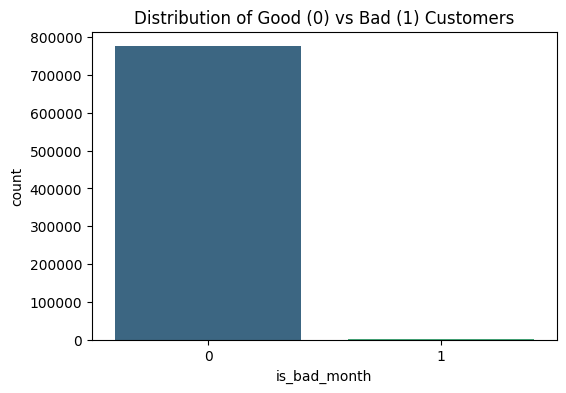
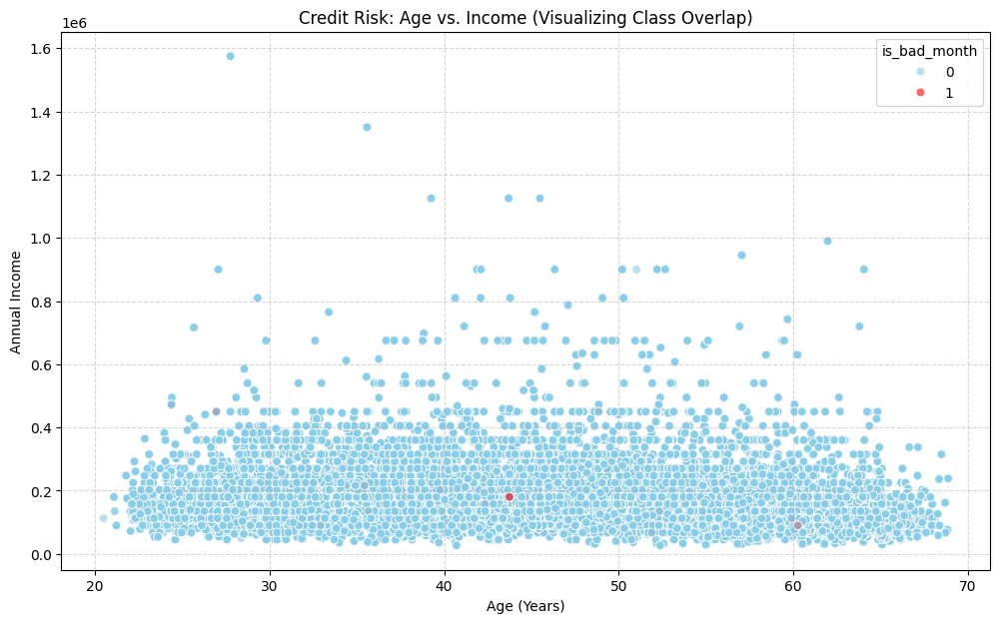

# Credit Risk Decision System
### `99% Recall on High-Risk Cases` · `94% Reduction in False Positives` · `XGBoost + SHAP`

> **A production-grade credit scoring pipeline that learned what banks already know: stability matters more than income.**

---

## The Problem

Standard credit risk models fail quietly. They hit 99% accuracy by simply predicting everyone is "Good" because in a real-world dataset, that's almost always true. In this dataset sourced from Kaggle's Credit Card Approval Prediction data, **"Bad" customers made up only 0.26% of records**. A naive model misses them entirely. A missed high-risk applicant costs the bank far more than a rejected safe one.

The goal: build a model that **never lets a bad borrower slip through**, even at the cost of flagging some false alarms.

---

## Results at a Glance

| Model | Recall (Bad) | Precision (Bad) | False Positives | AUC |
|---|---|---|---|---|
| Baseline Logistic Regression | 59% | ~0% | ~49,354 | 0.71 |
| **XGBoost + Threshold Tuning** | **99%** | **0.11** | **~2,900** | **~0.71** |

> **Achieved a 94% reduction in False Positives compared to the baseline model while maintaining 99% Recall** means the bank stops incorrectly rejecting ~46,000 creditworthy customers, a direct revenue and customer experience win.

---

## Architecture & Pipeline

```
Raw Data (Kaggle)
    ├── application_record.csv   → Applicant demographics & financials
    └── credit_record.csv        → Monthly payment history (STATUS flags)
            │
            ▼
    Merge on ID + Label Engineering
    (STATUS ∈ {3,4,5} → is_bad_month = 1)
            │
            ▼
    EDA & Feature Correlation Analysis
    (Dropped CNT_FAM_MEMBERS: corr = 0.89 with CNT_CHILDREN)
            │
            ▼
    Feature Engineering
    ├── income_per_capita = AMT_INCOME_TOTAL / (CNT_CHILDREN + 1)
    └── work_life_ratio   = YEARS_EMPLOYED / AGE
            │
            ▼
    SMOTE Oversampling → Train/Test Split (80/20, stratified)
            │
            ▼
    XGBoost Classifier (n_estimators=200, max_depth=7, lr=0.05)
            │
            ▼
    SHAP Explainability → Deployment (joblib)
```

---

## Technical Hurdles & Iterations

### Hurdle 1 — The Imbalance Problem



**0.26% minority class.** Accuracy as a metric was useless, a model that predicts "Good" for everyone scores 99.74% and is worthless. This forced a complete rethink of the evaluation strategy from the start.

**Fix:** Replaced accuracy with **Recall as the north star metric**. Applied SMOTE to the training set only (after the train/test split, a critical ordering to prevent data leakage). Used stratified splitting to preserve the minority class in both splits.

---

### Hurdle 2 — Logistic Regression's Ceiling

The baseline Logistic Regression caught **59% of bad customers**, but at a catastrophic cost: **49,354 false positives**, good customers incorrectly flagged as high-risk. An AUC of 0.71 told me the signal was there; the model just couldn't exploit it.

**Fix:** Upgraded to XGBoost for its ability to model non-linear interactions and handle feature importance natively. The tree ensemble learns the compound effect of low income *and* low stability *and* young age, interactions that a linear model fundamentally cannot capture.

---

### Hurdle 3 — The `scale_pos_weight` Trap

Early XGBoost experiments used `scale_pos_weight` to handle class imbalance. The result was **volatile risk scores**: a minor change in a single feature would swing a customer's predicted risk from 4.5% to 22%. The model was unstable and untrustworthy for production use.

**Fix:** Removed `scale_pos_weight` entirely. Since SMOTE had already balanced the training distribution, the weight parameter was redundant and actively harmful — it was overcorrecting an imbalance that no longer existed. This alone dramatically stabilized predictions.

---

### Hurdle 4 — Measuring "Goodness" vs "Badness"



The philosophical shift that changed everything: instead of asking *"how bad is this person at a high threshold?"*, ask *"how confident are we this person is good at a low threshold?"*.

Threshold tuning to **0.05** (below the default 0.5) shifts the decision boundary to be more conservative, **in financial risk, a false negative (missed bad customer) is catastrophically more expensive than a false positive (rejected good customer)**. The model was designed to reflect that asymmetry.

---

### Hurdle 5 — The `CNT_FAM_MEMBERS` Multicollinearity

Correlation analysis revealed:

$$\rho(\text{CNT\_FAM\_MEMBERS},\ \text{CNT\_CHILDREN}) = 0.89$$

Keeping both features creates redundancy that inflates the apparent importance of family-related signals and can destabilize gradient-based models. `CNT_FAM_MEMBERS` was dropped, reducing noise and improving interpretability.

---

## Feature Engineering

Two custom features drove measurable performance gains:

**`income_per_capita`** — Raw income is misleading. A ₽427,500 salary supporting 5 children is financially equivalent to ₽90,000 per person. This feature captures actual financial breathing room.

**`work_life_ratio`** — A 25-year-old with 2 years of employment and a 55-year-old with 2 years of employment are not the same risk profile. This ratio captures employment stability *relative to age*, which is exactly the heuristic a seasoned loan officer would apply manually.

SHAP analysis validated the intuition: **`work_life_ratio` ranked 3rd in global feature importance**, confirming that stability predicts default better than raw income.

---

## SHAP: Making the Model Auditable

Financial models that can't explain their decisions don't get deployed. SHAP (SHapley Additive exPlanations) was used to make every prediction interpretable.

Key finding from the SHAP summary plot:

- **Low `work_life_ratio`** → single strongest positive push toward "Bad" classification
- **Low `YEARS_EMPLOYED`** → second major red flag, regardless of income level
- **`income_per_capita`** → meaningful, but not dominant, confirming the EDA finding that income distributions overlap heavily between Good and Bad customers

The model "thinks" like an experienced credit analyst: **it trusts stability over salary**.

---

## Tech Stack

| Layer | Tools |
|---|---|
| Data Ingestion | `kagglehub`, `pandas` |
| EDA & Visualization | `matplotlib`, `seaborn` |
| Imbalance Handling | `imbalanced-learn` (SMOTE) |
| Modeling | `scikit-learn`, `XGBoost` |
| Explainability | `SHAP` |
| Deployment | `joblib` |
| Environment | Python 3.14, Jupyter Notebook |

---

## Project Structure

```
credit-risk-system/
│
├── .streamlit/
│   └── config.toml
│
├── assets/
│   ├── customers-distribution.png
│   └── scatterplot.png
│
├── models/
│   ├── credit_risk_model.pkl
│   ├── features.pkl
│   ├── scaler.pkl
│   └── shap_explainer.pkl
│
├── notebooks/
│   └── credit-risk-decision-system.ipynb
│
├── src/
│   ├── __init__.py
│   ├── processor.py
│   └── visualization.py
│
├── .env
├── .gitignore
├── app.py
├── README.md
└── requirements.txt
```

---

## Key Takeaways

- **Class imbalance is a design problem**, not just a preprocessing step. Every modeling decision, metric selection, splitting strategy, threshold calibration, must account for it from day one.
- **Domain logic accelerates ML.** Both engineered features (`income_per_capita`, `work_life_ratio`) came from asking "what would a credit analyst actually look at?" not from automated feature selection.
- **Explainability is a feature.** SHAP wasn't added as an afterthought; in regulated financial contexts, it's the difference between a model that gets approved and one that doesn't.

---

*Dataset: [Credit Card Approval Prediction](https://www.kaggle.com/datasets/rikdifos/credit-card-approval-prediction) by rikdifos on Kaggle*
